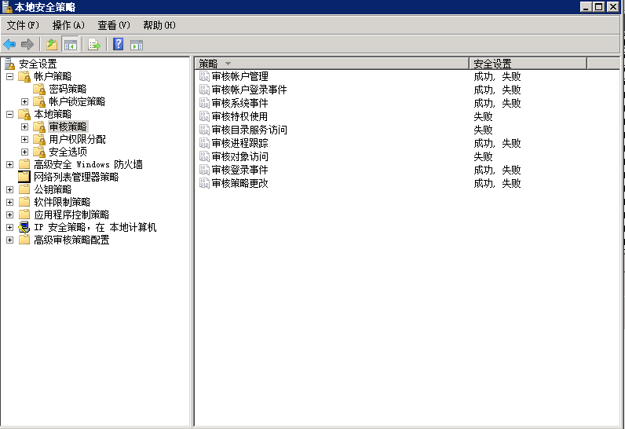
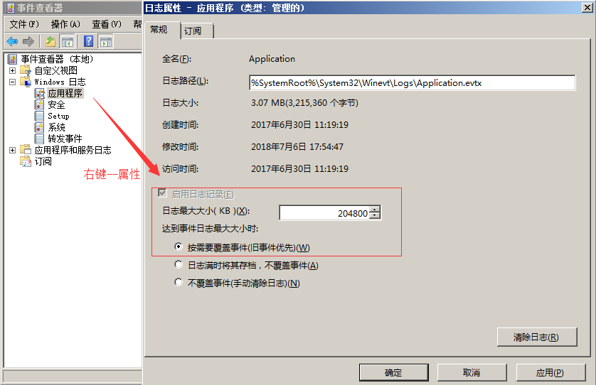
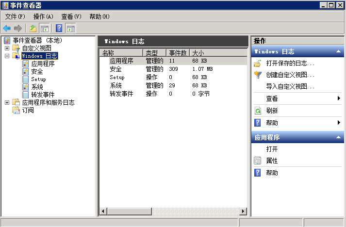
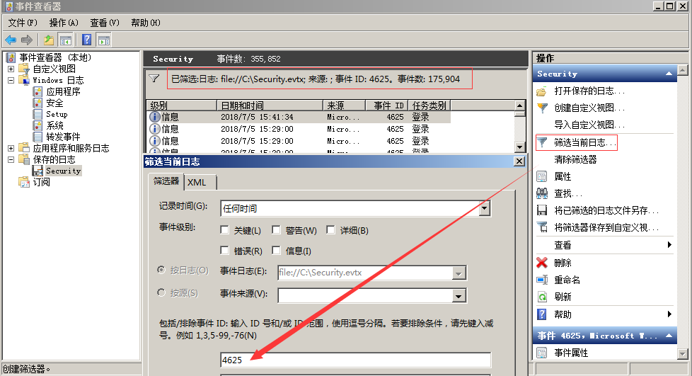
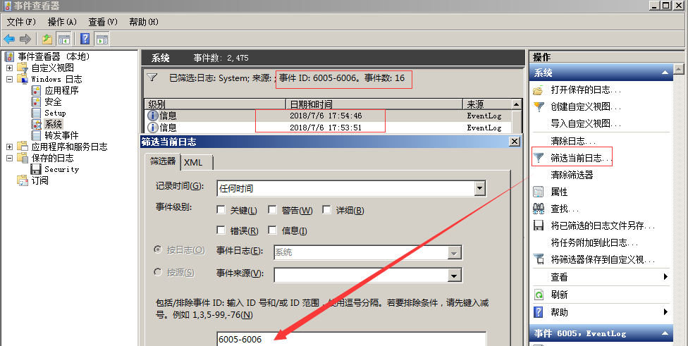
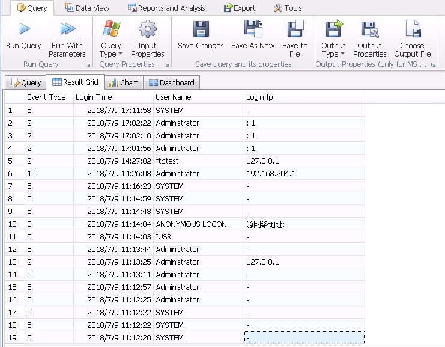
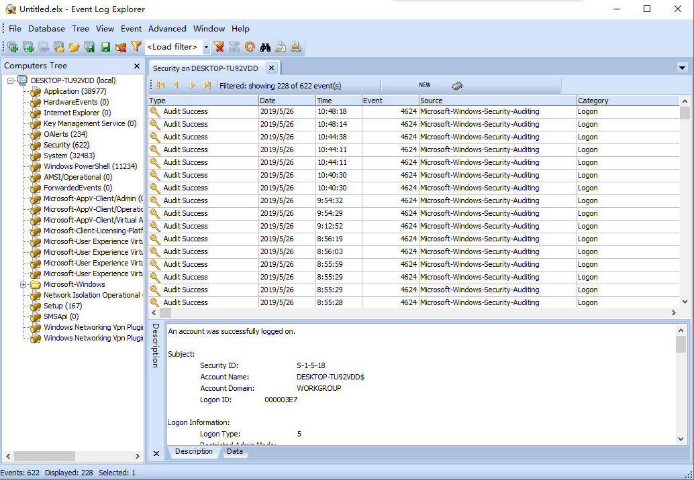

# 第1篇:Window日志分析

## 0x01 Window事件日志简介

Windows系统日志是记录系统中硬件、软件和系统问题的信息，同时还可以监视系统中发生的事件。用户可以通过它来检查错误发生的原因，或者寻找受到攻击时攻击者留下的痕迹。

Windows主要有以下三类日志记录系统事件：应用程序日志、系统日志和安全日志。

**系统日志**

```text
记录操作系统组件产生的事件，主要包括驱动程序、系统组件和应用软件的崩溃以及数据丢失错误等。系统日志中记录的时间类型由Windows NT/2000操作系统预先定义。

默认位置： %SystemRoot%\System32\Winevt\Logs\System.evtx
```

**应用程序日志**

```text
包含由应用程序或系统程序记录的事件，主要记录程序运行方面的事件，例如数据库程序可以在应用程序日志中记录文件错误，程序开发人员可以自行决定监视哪些事件。如果某个应用程序出现崩溃情况，那么我们可以从程序事件日志中找到相应的记录，也许会有助于你解决问题。 

默认位置：%SystemRoot%\System32\Winevt\Logs\Application.evtx
```

**安全日志**

```text
记录系统的安全审计事件，包含各种类型的登录日志、对象访问日志、进程追踪日志、特权使用、帐号管理、策略变更、系统事件。安全日志也是调查取证中最常用到的日志。默认设置下，安全性日志是关闭的，管理员可以使用组策略来启动安全性日志，或者在注册表中设置审核策略，以便当安全性日志满后使系统停止响应。

默认位置：%SystemRoot%\System32\Winevt\Logs\Security.evtx
```

​ 系统和应用程序日志存储着故障排除信息，对于系统管理员更为有用。 安全日志记录着事件审计信息，包括用户验证（登录、远程访问等）和特定用户在认证后对系统做了什么，对于调查人员而言，更有帮助。

## 0X02 审核策略与事件查看器

Windows Server 2008 R2 系统的审核功能在默认状态下并没有启用 ，建议开启审核策略，若日后系统出现故障、安全事故则可以查看系统的日志文件，排除故障，追查入侵者的信息等。

PS：默认状态下，也会记录一些简单的日志，日志默认大小20M

**设置1**：开始 → 管理工具 → 本地安全策略 → 本地策略 → 审核策略，参考配置操作：



**设置2**：设置合理的日志属性，即日志最大大小、事件覆盖阀值等：



**查看系统日志方法：**

1. 在**“开始”**菜单上，依次指向**“所有程序”**、**“管理工具”**，然后单击**“事件查看器”**
2. 按 "**Window+R**"，输入 ”**eventvwr.msc**“ 也可以直接进入“**事件查看器**”

   

## 0x03 事件日志分析

对于Windows事件日志分析，不同的EVENT ID代表了不同的意义，摘录一些常见的安全事件的说明：

| 事件ID | 说明 |
| :--- | :--- |
| 4624 | 登录成功 |
| 4625 | 登录失败 |
| 4634 | 注销成功 |
| 4647 | 用户启动的注销 |
| 4672 | 使用超级用户（如管理员）进行登录 |
| 4720 | 创建用户 |

每个成功登录的事件都会标记一个登录类型，不同登录类型代表不同的方式：

| 登录类型 | 描述 | 说明 |
| :--- | :--- | :--- |
| 2 | 交互式登录（Interactive） | 用户在本地进行登录。 |
| 3 | 网络（Network） | 最常见的情况就是连接到共享文件夹或共享打印机时。 |
| 4 | 批处理（Batch） | 通常表明某计划任务启动。 |
| 5 | 服务（Service） | 每种服务都被配置在某个特定的用户账号下运行。 |
| 7 | 解锁（Unlock） | 屏保解锁。 |
| 8 | 网络明文（NetworkCleartext） | 登录的密码在网络上是通过明文传输的，如FTP。 |
| 9 | 新凭证（NewCredentials） | 使用带/Netonly参数的RUNAS命令运行一个程序。 |
| 10 | 远程交互，（RemoteInteractive） | 通过终端服务、远程桌面或远程协助访问计算机。 |
| 11 | 缓存交互（CachedInteractive） | 以一个域用户登录而又没有域控制器可用 |

关于更多EVENT ID，详见微软官方网站上找到了“Windows Vista 和 Windows Server 2008 中的安全事件的说明”。

> 原文链接 ：[https://support.microsoft.com/zh-cn/help/977519/description-of-security-events-in-windows-7-and-in-windows-server-2008](https://support.microsoft.com/zh-cn/help/977519/description-of-security-events-in-windows-7-and-in-windows-server-2008)

案例1：可以利用eventlog事件来查看系统账号登录情况：

1. 在**“开始”**菜单上，依次指向**“所有程序”**、**“管理工具”**，然后单击**“事件查看器”**；
2. 在事件查看器中，单击**“安全”**，查看安全日志；
3. 在安全日志右侧操作中，点击**“筛选当前日志”**，输入事件ID进行筛选。

   4624 --登录成功  
   4625 --登录失败  
   4634 -- 注销成功 4647 -- 用户启动的注销  
   4672 -- 使用超级用户（如管理员）进行登录

我们输入事件ID：4625进行日志筛选，发现事件ID：4625，事件数175904，即用户登录失败了175904次，那么这台服务器管理员账号可能遭遇了暴力猜解。



案例2：可以利用eventlog事件来查看计算机开关机的记录：

1、在**“开始”**菜单上，依次指向**“所有程序”**、**“管理工具”**，然后单击**“事件查看器”**；

2、在事件查看器中，单击**“系统”**，查看系统日志；

3、在系统日志右侧操作中，点击**“筛选当前日志”**，输入事件ID进行筛选。

其中事件ID 6006 ID6005、 ID 6009就表示不同状态的机器的情况（开关机）。 6005 信息 EventLog 事件日志服务已启动。\(开机\) 6006 信息 EventLog 事件日志服务已停止。\(关机\) 6009 信息 EventLog 按ctrl、alt、delete键\(非正常\)关机

我们输入事件ID：6005-6006进行日志筛选，发现了两条在2018/7/6 17:53:51左右的记录，也就是我刚才对系统进行重启的时间。



## 0x04 日志分析工具

### Log Parser

Log Parser（是微软公司出品的日志分析工具，它功能强大，使用简单，可以分析基于文本的日志文件、XML 文件、CSV（逗号分隔符）文件，以及操作系统的事件日志、注册表、文件系统、Active Directory。它可以像使用 SQL 语句一样查询分析这些数据，甚至可以把分析结果以各种图表的形式展现出来。

Log Parser 2.2下载地址：[https://www.microsoft.com/en-us/download/details.aspx?id=24659](https://www.microsoft.com/en-us/download/details.aspx?id=24659)

Log Parser 使用示例：[https://mlichtenberg.wordpress.com/2011/02/03/log-parser-rocks-more-than-50-examples/](https://mlichtenberg.wordpress.com/2011/02/03/log-parser-rocks-more-than-50-examples/)


**基本查询结构**

```text
Logparser.exe –i:EVT –o:DATAGRID "SELECT * FROM c:\xx.evtx"
```

**使用Log Parser分析日志**

1、查询登录成功的事件

```text
登录成功的所有事件
LogParser.exe -i:EVT –o:DATAGRID  "SELECT *  FROM c:\Security.evtx where EventID=4624"

指定登录时间范围的事件：
LogParser.exe -i:EVT –o:DATAGRID  "SELECT *  FROM c:\Security.evtx where TimeGenerated>'2018-06-19 23:32:11' and TimeGenerated<'2018-06-20 23:34:00' and EventID=4624"

提取登录成功的用户名和IP：
LogParser.exe -i:EVT  –o:DATAGRID  "SELECT EXTRACT_TOKEN(Message,13,' ') as EventType,TimeGenerated as LoginTime,EXTRACT_TOKEN(Strings,5,'|') as Username,EXTRACT_TOKEN(Message,38,' ') as Loginip FROM c:\Security.evtx where EventID=4624"
```

2、查询登录失败的事件

```text
登录失败的所有事件：
LogParser.exe -i:EVT –o:DATAGRID  "SELECT *  FROM c:\Security.evtx where EventID=4625"

提取登录失败用户名进行聚合统计：
LogParser.exe  -i:EVT "SELECT  EXTRACT_TOKEN(Message,13,' ')  as EventType,EXTRACT_TOKEN(Message,19,' ') as user,count(EXTRACT_TOKEN(Message,19,' ')) as Times,EXTRACT_TOKEN(Message,39,' ') as Loginip FROM c:\Security.evtx where EventID=4625 GROUP BY Message"
```

3、系统历史开关机记录：

```text
LogParser.exe -i:EVT –o:DATAGRID  "SELECT TimeGenerated,EventID,Message FROM c:\System.evtx where EventID=6005 or EventID=6006"
```

### LogParser Lizard

对于GUI环境的Log Parser Lizard，其特点是比较易于使用，甚至不需要记忆繁琐的命令，只需要做好设置，写好基本的SQL语句，就可以直观的得到结果。

下载地址：[http://www.lizard-labs.com/log\_parser\_lizard.aspx](http://www.lizard-labs.com/log_parser_lizard.aspx)

依赖包：Microsoft .NET Framework 4 .5，下载地址：[https://www.microsoft.com/en-us/download/details.aspx?id=42642](https://www.microsoft.com/en-us/download/details.aspx?id=42642)

查询最近用户登录情况：



### Event Log Explorer

Event Log Explorer是一款非常好用的Windows日志分析工具。可用于查看，监视和分析跟事件记录，包括安全，系统，应用程序和其他微软Windows 的记录被记载的事件，其强大的过滤功能可以快速的过滤出有价值的信息。

下载地址：[https://event-log-explorer.en.softonic.com/](https://event-log-explorer.en.softonic.com/)



参考链接：

Windows日志分析 [https://mp.weixin.qq.com/s/ige5UO8WTuOOO3yRw-LeqQ](https://mp.weixin.qq.com/s/ige5UO8WTuOOO3yRw-LeqQ)

